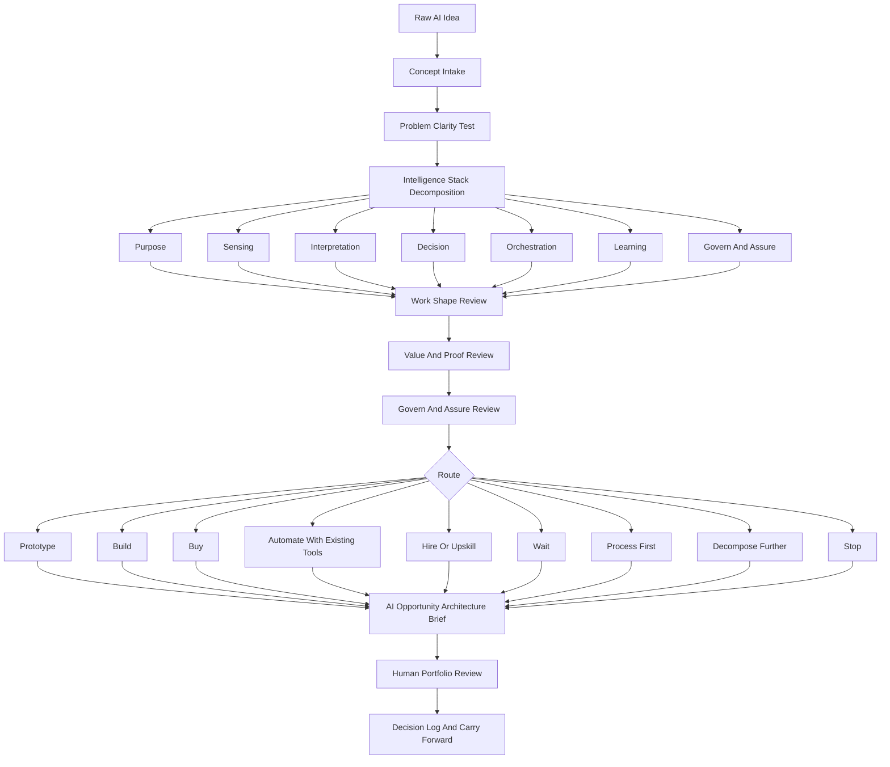
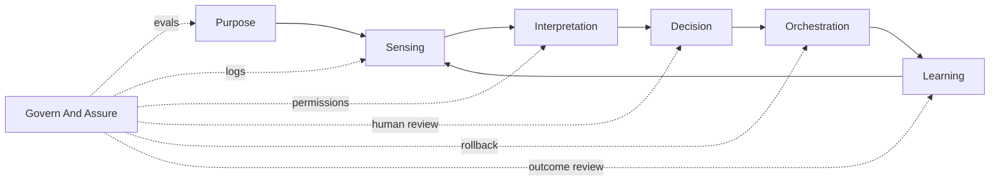
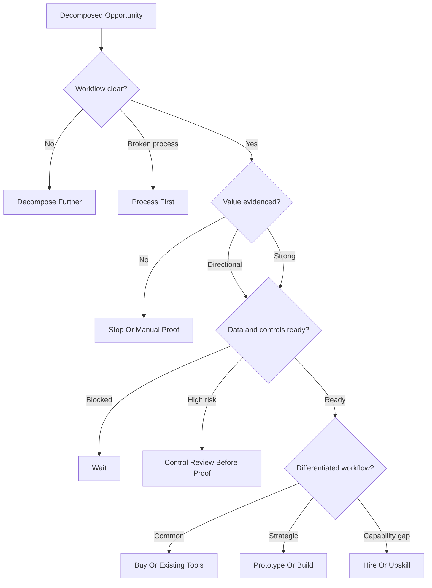

# AI Opportunity Intelligence Review System

A human-governed, AI-assisted operating system for decomposing vague AI ideas into intelligence architecture, proof requirements, value logic, governance controls, and build/buy/wait routes before teams spend time on demos, vendors, proofs of concept, or delivery planning.

## Status

Public portfolio prototype. Designed for ChatGPT Project use, executive review, and workflow demonstration. Not a SaaS product, autonomous approval engine, or substitute for accountable AI governance.

## How to evaluate this repo

Start with the README to understand the operating model, then inspect:

- [`chatgpt-project/`](chatgpt-project/) for the flat ChatGPT runtime.
- [`examples/sample-data/`](examples/sample-data/) for synthetic AI opportunity inputs.
- [`examples/sample-outputs/`](examples/sample-outputs/) for generated architecture, routing, and governance outputs.
- [`quality-review/`](quality-review/) for cohesion and senior-operator critique.

Evaluate the repo on whether it separates AI enthusiasm from workflow value, proof burden, data readiness, controls, and human decision rights.

## Before and after example

Before: a team has a list of AI ideas, vendor claims, or prototype requests, but the work is bundled, the value evidence is uneven, and leaders do not know whether to build, buy, wait, process-map, or stop.

After: each idea is decomposed into purpose, sensing, interpretation, decision, orchestration, learning, and govern/assure controls, with a route recommendation, proof plan, missing evidence, and human portfolio review path.

## Positioning

AI makes it easier to propose projects than to understand them.

This project helps PMO, EPMO, product, operations, strategy, and AI transformation leaders turn rough AI concepts into clear operating designs. It asks what kind of intelligence the idea actually needs, what workflow it changes, what signals it observes, what judgments it makes, what it orchestrates, how it learns, and what controls keep humans accountable.

The goal is not to create another approval layer. The goal is to create an intelligence review layer.

## What Problem This Solves

Organizations are about to get more AI ideas, cheaper prototypes, faster demos, and louder vendor claims. That creates a portfolio risk: wasting leadership attention, scarce change capacity, and engineering time on ideas that sound AI-native but do not improve a meaningful workflow.

The better question is not:

> Can we build a proof of concept?

The better question is:

> What intelligence system is this idea actually asking for, and what is the cheapest trustworthy way to prove or disprove it?

## Who This Is For

- PMO, EPMO, and portfolio leaders
- AI transformation and operations leaders
- Product, strategy, and business operations teams
- Chiefs of staff and executive operators
- Governance teams reviewing AI demand
- Leaders deciding whether to automate, build, buy, hire, wait, prototype, process-map, or stop

## What It Does

- Converts rough AI ideas into structured concept records.
- Decomposes each idea into an intelligence stack: purpose, sensing, interpretation, decision, orchestration, learning, and governance.
- Separates business problems from AI enthusiasm.
- Identifies whether the idea is one workflow, several smaller workflows, a data problem, a process problem, a vendor fit, or a capability gap.
- Reviews value clarity, workflow readiness, data readiness, proof burden, governance controls, and strategic fit.
- Routes opportunities to prototype, build, buy, automate with existing tools, hire/upskill, wait, process-first, decompose further, or stop.
- Produces an AI opportunity architecture brief, experiment plan, governance/control review, and portfolio triage summary.

## What It Does Not Do

- It does not approve AI projects.
- It does not replace executive judgment, finance review, legal review, security review, architecture review, procurement review, or product ownership.
- It does not estimate ROI from invented numbers.
- It does not connect to live systems or send data to vendors.
- It does not claim that a proof of concept is always cheaper than deciding not to build.
- It does not treat every AI idea as a build opportunity.

## Source Lessons

This package is based on lessons synthesized from five public YouTube videos supplied as research inputs. The public project contains derived lessons and workflow design, not copied transcript text.

Key synthesized lessons:

- AI investment is a work-shape question before it is a model or vendor question.
- Repeatable AI work needs scaffolding: instructions, tools, scripts, connectors, skills, logs, evals, and human review.
- Automation often creates higher-order human work: monitoring, exception handling, problem solving, design, and assurance.
- Agentic systems need an intelligence loop: purpose, sensing, interpretation, decision, orchestration, learning.
- That loop needs a govern-and-assure wrapper: evals, searchable logs, rollback, permissions, and human review queues.
- Claims need proof. AI-native positioning without evidence is fragile.

See [`research/source_video_lessons.md`](research/source_video_lessons.md) for the source lesson synthesis.

## Program Framework

The operating framework is **AI Opportunity Intelligence Review**.

| Stage | Purpose | Output |
| --- | --- | --- |
| Concept Intake | Capture the AI idea, sponsor, workflow, user, pain, expected outcome, and proposed AI role. | Structured concept record |
| Problem Test | Separate the business problem from tool enthusiasm. | Problem clarity rating |
| Intelligence Decomposition | Break the idea into purpose, sensing, interpretation, decision, orchestration, learning, and govern/assure controls. | Intelligence stack map |
| Work Shape Review | Classify the work as bounded task, synthesis, exception handling, decision prep, interaction, data extraction, coordination, or unclear work. | Workflow-shape rating |
| Value And Proof Review | Define measurable value, baseline, evidence, proof burden, and stop conditions. | Proof plan |
| Build/Buy/Hire/Wait Routing | Recommend the next route based on architecture, value, risk, and maturity. | Route recommendation |
| Governance And Assurance | Define human review, evals, logs, rollback, approvals, and risk controls. | Control model |
| Decision Brief | Summarize route, rationale, missing evidence, next proof, owner, and human decision needed. | AI opportunity brief |

## How It Fits The Portfolio Lifecycle

This system sits upstream of the current product set:

1. **AI Opportunity Intelligence Review System** - decomposes and evaluates AI ideas before investment.
2. **Business Case System** - develops decision-ready business cases for opportunities that require investment justification.
3. **Project Charter Initiation Agent** - converts approved intent into sponsor-ready project charters.
4. **Portfolio Prioritization Scoring Agent** - compares approved work through transparent portfolio scoring.
5. **PMO Governance Operations Log** - helps operate the recurring governance rhythm once work is underway.

## GitHub Layer vs ChatGPT Runtime Layer

This repository has two shapes:

- **GitHub repository layer:** this full folder, used for discovery, examples, sample data, templates, workflow diagrams, local tooling, and quality review.
- **ChatGPT Project runtime layer:** the flat [`chatgpt-project/`](chatgpt-project/) folder, used as the actual operating system inside ChatGPT.

## How To Use This In ChatGPT

Upload only the files inside [`chatgpt-project/`](chatgpt-project/) when creating a ChatGPT Project. Do not upload the full repository. The other folders provide examples, templates, generated outputs, workflow diagrams, local tooling, and public portfolio context.

Start with:

```text
Use this project to decompose the attached AI opportunity ideas into intelligence stacks, value/proof reviews, route recommendations, and governance controls.
```

## How To Use This In Codex

Use the full repository when you want local sample runs, CSV validation, generated Markdown/HTML outputs, or project modifications.

```bash
python tools/decompose_ai_opportunities.py \
  --input examples/sample-data/synthetic_ai_opportunities.csv \
  --output-dir examples/sample-outputs
```

## Folder Structure

```text
ai-opportunity-intelligence-review-system/
  README.md
  AGENTS.md
  LICENSE.md
  .gitignore
  chatgpt-project/
  examples/
    sample-data/
    sample-prompts/
    sample-outputs/
  templates/
  tools/
  workflow/
  quality-review/
  research/
```

## Workflow



## Intelligence Stack Loop



## Route Decision Map



## Sample Outputs

The sample tool generates:

- AI opportunity portfolio summary
- Intelligence stack decomposition table
- Route recommendation table
- Opportunity architecture briefs
- Experiment plan starters
- Governance and assurance control review
- Findings logs in CSV and JSONL
- Standalone HTML review pack

## Human-Control Statement

The system may recommend that an idea appears ready for a prototype, should wait, needs process cleanup first, requires further decomposition, or lacks credible value evidence. It must not approve funding, commit resources, accept risk, select vendors, authorize hiring, or change portfolio sequencing. Those remain human leadership decisions.

## Keywords

AI portfolio management, AI governance, AI opportunity triage, AI business value, AI use case evaluation, AI transformation, intelligence stack, AI operating model, AI decomposition, PMO, EPMO, portfolio governance, build buy wait, AI proof of concept, human-in-the-loop, AI decision support, ChatGPT Project, Codex.
