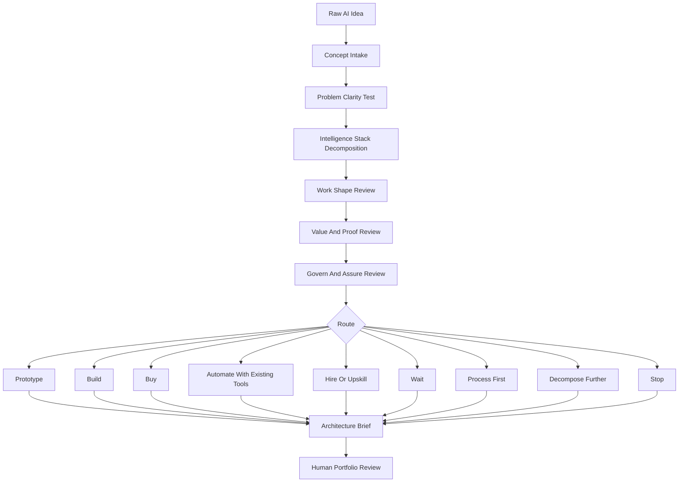
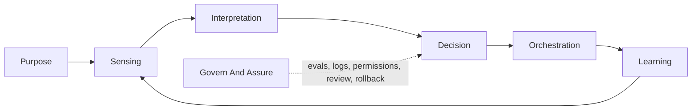
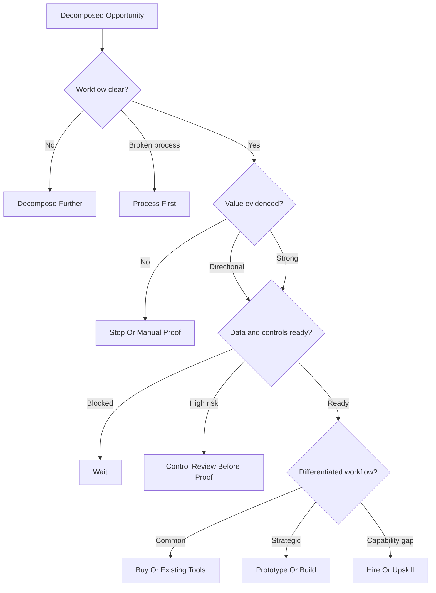

# AI Opportunity Intelligence Review Workflow

This workflow converts rough AI ideas into intelligence-stack maps, route recommendations, and decision-ready proof plans.

## End-To-End Review

## Intelligence Stack

## Route Logic

