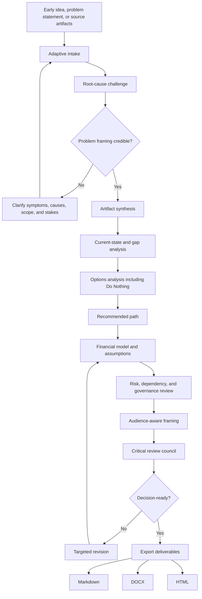

# Business Case System

A structured, AI-assisted business case development system for turning rough ideas and source artifacts into decision-ready business cases.

Business Case System helps users interview an idea, challenge weak or solution-first problem framing, test root-cause assumptions, evaluate real options, build a defensible financial case, surface material risks, apply audience-aware review, and generate polished outputs in Markdown, DOCX, or HTML.

It is not a substitute for business judgment, sponsor accountability, financial scrutiny, or governance discipline. It is a structured operating workflow for applying those disciplines before a business case reaches an executive sponsor, CFO, approval body, or governance forum.

## Who this is for

- Business owners shaping an investment request
- Knowledge workers turning messy notes into a decision document
- Managers and senior leaders preparing an approval case
- Software, engineering, operations, and delivery teams proposing change
- Portfolio, PMO, strategy, and operations teams supporting governance review

## What it does

- Runs adaptive intake instead of a static questionnaire
- Distinguishes symptoms from root causes before drafting
- Ingests notes, spreadsheets, project plans, CSVs, Word documents, and source artifacts
- Evaluates options, including a genuine Do Nothing option
- Builds a financial view with hard/soft benefit separation and assumptions
- Names risks, dependencies, constraints, owners, and residual exposure
- Applies audience-aware framing for finance, executive, operational, and technical reviewers
- Produces Markdown, DOCX, and HTML outputs
- Preserves human control over claims, decisions, and final approval

## Workflow



The Mermaid source is also available in [`workflow/business-case-system-workflow.mmd`](workflow/business-case-system-workflow.mmd).

## Repository structure

```text
business-case-system/
  README.md
  AGENTS.md
  LICENSE.md
  .gitignore

  chatgpt-project/       # Flat runtime folder for ChatGPT Projects
  examples/              # Sample data, prompts, and generated outputs
  templates/             # Reusable templates and CSV scaffolds
  workflow/              # Mermaid workflow diagram source
  tools/                 # Optional local Python tooling
  quality-review/        # Package QA notes and design review
```

## How to use this in ChatGPT

Upload only the files inside `chatgpt-project/` when creating a ChatGPT Project. Do not upload the full repository.

The root repository is for GitHub discovery, examples, sample data, workflow diagrams, generated outputs, templates, and optional local tooling. The `chatgpt-project/` folder is the runtime product.

## How to use locally

This repo includes a lightweight Python CLI for local generation and smoke testing.

```bash
python -m venv .venv
source .venv/bin/activate   # Windows: .venv\Scripts\activate
pip install -e .
business-case-system build --sample --out ./out --formats md html docx
```

Local tooling is optional. The ChatGPT runtime files are the primary product.

## Sample outputs

See:

- `examples/sample-prompts/`
- `examples/sample-data/`
- `examples/sample-outputs/`

The included sample scenario is fictional and uses dummy data only.

## Human-control note

Business Case System does not approve investments, invent financial evidence, replace stakeholder judgment, or remove sponsor accountability. It structures the case, exposes weak assumptions, and helps the user produce a stronger decision document.
