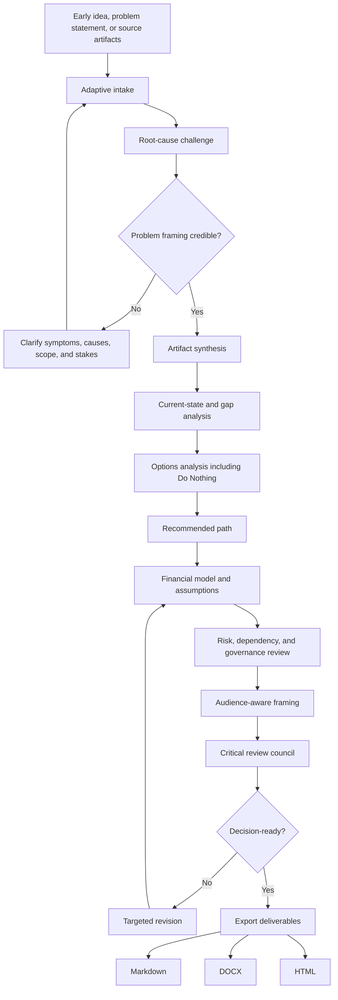

```mermaid
flowchart TD
    A[Early idea, problem statement, or source artifacts] --> B[Adaptive intake]
    B --> C[Root-cause challenge]
    C --> D{Problem framing credible?}
    D -- No --> E[Clarify symptoms, causes, scope, and stakes]
    E --> B
    D -- Yes --> F[Artifact synthesis]
    F --> G[Current-state and gap analysis]
    G --> H[Options analysis including Do Nothing]
    H --> I[Recommended path]
    I --> J[Financial model and assumptions]
    J --> K[Risk, dependency, and governance review]
    K --> L[Audience-aware framing]
    L --> M[Critical review council]
    M --> N{Decision-ready?}
    N -- No --> O[Targeted revision]
    O --> J
    N -- Yes --> P[Export deliverables]
    P --> Q[Markdown]
    P --> R[DOCX]
    P --> S[HTML]
```
