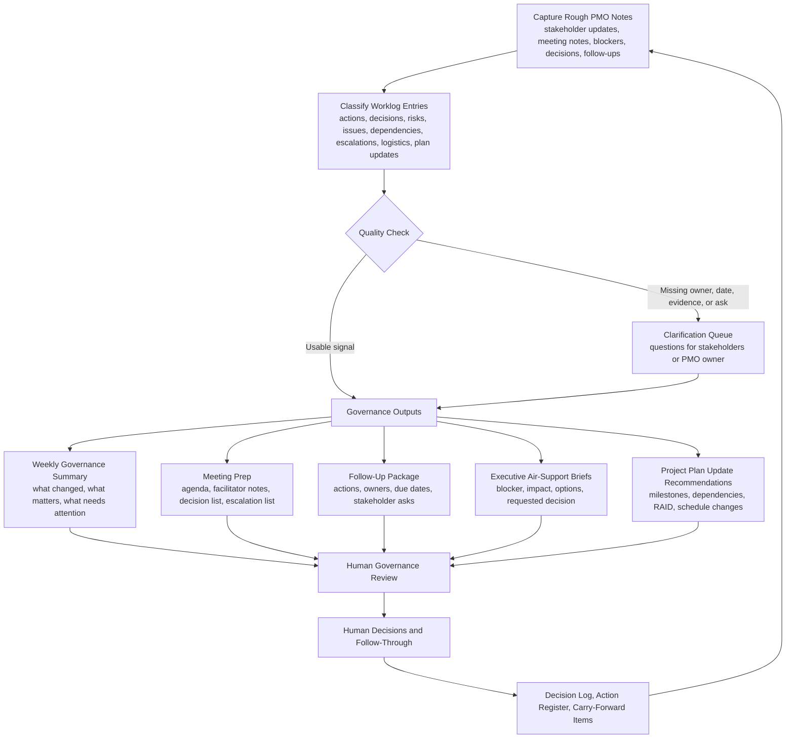

# PMO Governance Operations Log

A human-governed, AI-assisted PMO worklog system for turning rough weekly notes, stakeholder updates, meeting outcomes, blockers, decisions, follow-up items, and escalation needs into structured governance summaries, action registers, decision logs, executive air-support briefs, project plan update recommendations, and next-meeting prep.

## Status

Public portfolio prototype. Designed for ChatGPT Project use, governance review, and workflow demonstration. Not a SaaS product, PPM replacement, autonomous project manager, or substitute for accountable PMO leadership.

## How to evaluate this repo

Open these first:

- [`chatgpt-project/`](chatgpt-project/) for the flat ChatGPT runtime.
- [`examples/sample-data/`](examples/sample-data/) for synthetic PMO worklog inputs.
- [`examples/sample-outputs/`](examples/sample-outputs/) for generated summaries, logs, briefs, and HTML outputs.
- [`quality-review/`](quality-review/) for senior PMO critique.

Evaluate the repo on whether it turns rough operational noise into decisions, actions, escalations, risks, stakeholder follow-ups, plan updates, and next-meeting prep without pretending the AI owns the governance cycle.

## Before and after example

Before: updates, blockers, meeting notes, decisions, and follow-ups are scattered across messages, notes, and status conversations, making it hard to see what needs action before the next governance meeting.

After: rough PMO notes are classified into governance signals, summarized for leaders, converted into action and decision registers, and carried forward into meeting prep and follow-through.

This project is part of a PMO and portfolio operating-system sequence:

1. Business Case Counselor - turns early ideas into decision-ready investment cases.
2. Project Charter Initiation Agent - turns approved ideas into sponsor-ready project charters.
3. Portfolio Prioritization Scoring Agent - compares approved work through transparent portfolio scoring.
4. PMO Governance Operations Log - helps operate the recurring governance cycle once work is underway.

## What problem this solves

Portfolio governance often fails in the operational middle: updates are late, green status is weak, decisions are not logged, follow-up actions drift, executives are asked for help too late, and meeting notes do not reliably become project plan updates.

This project is designed for the person who actually runs that rhythm: the PMO lead, portfolio manager, program manager, delivery governance owner, chief of staff, or operations lead who prepares the room, chases updates, facilitates discussion, captures decisions, maintains logs, and coordinates follow-through.

## What this is

This is a structured, AI-assisted operating system for:

- capturing rough PMO worklog notes over time
- classifying notes into actions, decisions, risks, blockers, dependencies, escalations, meeting logistics, stakeholder follow-ups, and plan updates
- preparing weekly or monthly governance summaries
- preparing meeting agendas and facilitator notes
- extracting decisions and action items from rough meeting notes
- drafting escalation / executive air-support briefs
- identifying stale updates, missing owners, weak status signals, and overdue follow-ups
- carrying unresolved items into the next governance cycle

## What this is not

This is not a PPM platform, project-management replacement, portfolio scoring engine, business-case or charter builder, or autonomous decision engine.

The AI supports structure, synthesis, classification, and draft outputs. Humans remain accountable for decisions, commitments, escalation paths, funding, sequencing, approval, cancellation, and risk acceptance.

## How to use this in ChatGPT

Upload only the files inside `chatgpt-project/` when creating a ChatGPT Project.

Do not upload the full repository. The other folders are for examples, templates, workflow diagrams, local tooling, sample outputs, and GitHub review.

The `chatgpt-project/` folder is intentionally flat and contains fewer than 25 files. It is the runtime product.

## Recommended ChatGPT use pattern

1. Keep a running weekly PMO worklog.
2. Drop rough notes, meeting outcomes, stakeholder updates, blockers, and follow-ups into the chat.
3. Ask the agent to classify the notes and produce governance outputs.
4. Save the resulting summaries, logs, and follow-ups back into your working files.
5. Repeat the next governance cycle.

Example user request:

"Review this week's PMO worklog and produce an executive summary, decisions needed, overdue actions, stakeholder follow-ups, escalation candidates, project plan update recommendations, and next-meeting prep."

## Repository structure

```text
pmo-governance-operations-log/
  README.md
  AGENTS.md
  LICENSE.md
  .gitignore
  chatgpt-project/
  docs/
  examples/
  templates/
  tools/
  workflow/
  quality-review/
```

## Workflow



## Design principles

- Start from messy operating reality, not idealized templates.
- Treat rough notes as governance signals.
- Separate routine status from decisions, escalations, blockers, and follow-through.
- Make owners, due dates, asks, and unresolved items explicit.
- Keep the agent advisory and auditable.
- Keep humans responsible for decisions and commitments.
- Use HTML for human reference documents and human-facing examples.
- Keep the ChatGPT runtime flat, small, and operational.

## Synthetic examples

The examples use fictional initiatives only:

- Regulatory Reporting Remediation
- Customer Portal Modernization
- Field Operations Workflow Automation
- Data Platform Stabilization

No employer, client, financial, security, or personal data is included.

## Local tooling

A lightweight Python script is included under `tools/`. It demonstrates how worklog rows can be classified into governance output categories and converted into HTML reports.

Run from the repository root:

```bash
python tools/process_operations_log.py
```

The script reads `examples/sample-data/synthetic_operations_log.csv` and writes generated outputs to `examples/sample-outputs/generated/`.

## License

No public open-source license has been selected yet. See `LICENSE.md`.
