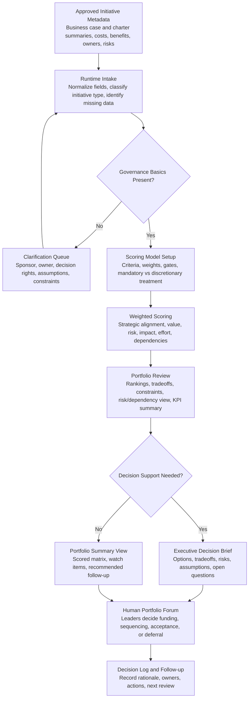

# Portfolio Prioritization Scoring Agent

A human-governed, AI-assisted portfolio decision-support system for evaluating approved projects and programs through transparent weighted scoring, portfolio metadata, strategic themes, constraints, risks, dependencies, ownership, and executive review artifacts.

This is not a funding engine, autonomous prioritization system, or replacement for a portfolio board. It helps humans structure the conversation, inspect tradeoffs, and make better decisions.

## Status

Public portfolio prototype. Designed for ChatGPT Project use, executive review, and workflow demonstration. Not a SaaS product, optimization engine, autonomous funding tool, or replacement for portfolio governance.

## How to evaluate this repo

Open these first:

- [`chatgpt-project/`](chatgpt-project/) for the flat ChatGPT runtime.
- [`examples/sample-data/`](examples/sample-data/) for synthetic portfolio inputs.
- [`examples/sample-outputs/`](examples/sample-outputs/) for scored matrices, executive briefs, logs, HTML, and DOCX outputs.
- [`quality-review/`](quality-review/) for senior portfolio-manager critique.

Evaluate the repo on whether it makes scoring transparent, separates mandatory and discretionary work, surfaces weak metadata, preserves human decision rights, and turns prioritization into an auditable conversation.

## Before and after example

Before: leaders have a portfolio of approved or proposed initiatives, but priorities are defended through narrative, urgency, politics, or incomplete data rather than visible criteria and tradeoffs.

After: initiatives are normalized, scored through explicit criteria and weights, separated by mandatory/discretionary treatment, reviewed for missing owners and risks, and prepared for a human portfolio forum.

## Operating problem

Organizations often have many approved or proposed initiatives but no consistent way to compare their strategic value, financial contribution, risk, effort, mandatory status, dependencies, and operational impact. The result is noisy prioritization, unclear ownership, overloaded teams, and decisions that are hard to defend later.

This project helps portfolio leaders convert initiative metadata into a visible scoring model and decision-support package.

## Who this is for

- PMO, EPMO, and portfolio leaders
- Program and project leaders
- Business owners and sponsors
- Finance, technology, operations, and product stakeholders
- Knowledge workers who need a structured prioritization model without pretending the AI owns the decision

## What it does

- Defines portfolio categories, criteria, weights, gates, and review cadence
- Normalizes initiative metadata from business cases, charters, spreadsheets, or notes
- Applies transparent weighted scoring
- Separates mandatory and discretionary work
- Surfaces missing owners, unclear decision rights, weak assumptions, risks, and dependencies
- Produces portfolio summaries, scoring matrices, decision briefs, logs, and quality reviews

## What it does not do

- It does not make final funding or sequencing decisions
- It does not replace sponsor, finance, technology, or executive governance review
- It does not create full business cases or project charters
- It does not perform opaque optimization or machine-learning ranking
- It does not require real company data; all examples are synthetic

## How to use this in ChatGPT

Upload only the files inside `chatgpt-project/` when creating a ChatGPT Project. Do not upload the full repository. The other folders provide examples, sample data, templates, generated outputs, workflow diagrams, quality review, and local tooling for GitHub or Codex use.

The runtime folder is flat, self-contained, and designed to stay under the ChatGPT Project file-count limit.

Recommended first prompt after upload:

"Use the runtime instructions and trigger map to help me set up a portfolio prioritization scoring model. Interview me for strategy, initiative categories, scoring criteria, weights, governance cadence, budget/capacity constraints, and decision-rights assumptions. Keep final decisions human-owned."

## Workflow

## Repository structure

- `chatgpt-project/` - flat runtime folder for ChatGPT upload
- `examples/` - synthetic data, sample prompts, sample outputs, and source artifacts
- `templates/` - reusable templates for review outside the runtime folder
- `tools/` - local Python scoring utility
- `workflow/` - Mermaid workflow diagram
- `quality-review/` - senior portfolio manager self-critique

## Human-control model

The system may recommend scoring approaches, identify gaps, calculate weighted scores, summarize tradeoffs, and prepare decision briefs. It must not approve, cancel, fund, sequence, or accept risk on behalf of leaders.
