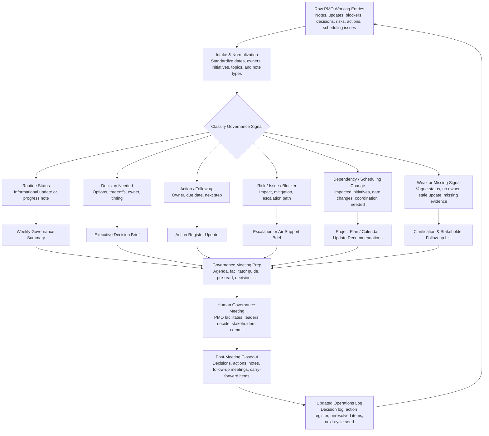

# Portfolio Governance Operations Log

A human-governed, AI-assisted PMO worklog system for turning rough notes, stakeholder updates, blockers, decisions, risks, scheduling changes, and follow-up items into usable portfolio governance artifacts.

This project is not a PPM platform, meeting-transcription product, autonomous project manager, or executive decision engine. It is a practical operating layer for PMO and portfolio leaders who need to capture messy governance signals during the week and convert them into weekly summaries, meeting prep, action registers, decision logs, escalation briefs, plan-update recommendations, stakeholder follow-up lists, and closeout records while keeping accountability with people.

## What problem it solves

Portfolio governance often fails in the handoff between meetings:

- status is captured but not challenged;
- actions lack owners or dates;
- blockers are discussed but not escalated cleanly;
- risks are noted without mitigation;
- decisions are requested without options;
- stale “green” updates carry forward without evidence;
- follow-ups are scattered across chat, email, notes, and calendar changes.

This repository provides a public-safe example of how an AI-assisted PMO workflow can help structure those signals without taking authority away from the PMO lead, sponsors, executives, or accountable delivery owners.

## Who it is for

Primary users:

- PMO leads
- Portfolio managers
- Program managers
- Project managers
- Governance leads
- Chiefs of staff
- Operations managers
- Delivery leaders
- Business owners who run recurring governance meetings
- Knowledge workers who coordinate work across multiple teams

Secondary users:

- Senior managers and executives who consume governance outputs
- Stakeholders who owe updates, actions, decisions, or risk input
- AI builders looking for a public-safe example of practical PMO workflow design

## What it does

The system helps a PMO operator:

1. capture rough worklog entries during the week;
2. normalize and classify governance signals;
3. detect missing owners, dates, evidence, options, and escalation asks;
4. generate a weekly governance summary;
5. prepare a 60-minute governance meeting;
6. draft stakeholder follow-up requests;
7. draft executive air-support briefs;
8. recommend project plan, RAID, decision-log, and action-register updates;
9. produce post-meeting closeout artifacts;
10. carry unresolved items into the next governance cycle.

## What it does not do

The system does **not**:

- approve work;
- cancel work;
- fund initiatives;
- sequence or reprioritize the portfolio;
- reassign owners;
- accept risks;
- send emails;
- modify calendars;
- modify real project plans;
- connect to external systems;
- replace the PMO, sponsor, or executive decision process.

## How the workflow works



## Folder structure

```text
portfolio-governance-operations-log/
  README.md
  AGENTS.md
  LICENSE.md
  .gitignore
  prompts/
  guidance/
  templates/
  rubrics/
  sample-data/
  sample-prompts/
  sample-outputs/
    markdown/
    html/
  workflow/
  tools/
  quality-review/
```

## How to run the sample tool

From the repository root:

```bash
python tools/build_governance_outputs.py
```

The tool uses only Python standard libraries. It reads synthetic CSV files from `sample-data/`, validates required columns, classifies worklog entries with transparent rule-based logic, and regenerates Markdown and HTML outputs under `sample-outputs/`.

Expected outputs include:

- `sample-outputs/markdown/classified_worklog.md`
- `sample-outputs/markdown/weekly_governance_summary.md`
- `sample-outputs/markdown/meeting_agenda.md`
- `sample-outputs/markdown/facilitator_guide.md`
- `sample-outputs/markdown/stakeholder_follow_up_plan.md`
- `sample-outputs/markdown/executive_air_support_brief.md`
- `sample-outputs/markdown/project_plan_update_recommendations.md`
- `sample-outputs/markdown/post_meeting_closeout_summary.md`
- `sample-outputs/markdown/signal_quality_review.md`
- matching HTML versions in `sample-outputs/html/`
- `sample-outputs/findings_log.csv`
- `sample-outputs/findings_log.jsonl`

## Example user prompts

- “Classify these rough PMO worklog notes and tell me what needs action before the governance meeting.”
- “Generate a weekly portfolio governance summary from this worklog, separating routine status from decisions, risks, blockers, and follow-ups.”
- “Prepare a 60-minute governance meeting agenda and facilitator guide.”
- “Create a concise executive air-support brief for the Customer Portal / Data Platform blocker.”
- “Turn these meeting notes into decisions, actions, owners, due dates, unresolved items, and next-cycle carry-forward topics.”

Detailed reusable prompts are included in `sample-prompts/` and `prompts/`.

## Human-control statement

This project supports interpretation and drafting. It does not make governance decisions.

The AI may classify notes, summarize patterns, identify missing information, suggest follow-up, draft agendas, draft briefs, and recommend plan updates for human confirmation. Humans retain ownership of decisions, commitments, approvals, project-plan changes, escalations, funding, sequencing, and risk acceptance.

Acceptable phrasing:

- “This note appears to require stakeholder follow-up.”
- “This issue may need executive air support.”
- “This decision request lacks clear options.”
- “This update appears stale or under-supported.”
- “This action lacks an owner or due date.”
- “This project-plan change should be confirmed before updating the plan.”

Not acceptable:

- “The project has been reprioritized.”
- “The funding is approved.”
- “This risk is accepted.”
- “This project should be canceled.”
- “This owner has been reassigned.”
- “The executive team decided this” unless the user provided that decision explicitly.

## Data privacy and synthetic-data statement

All sample data in this repository is synthetic. It does not include real employer, client, personal, financial, security, or proprietary information.

When adapting this workflow, avoid entering sensitive information unless the environment is approved for that data. Scrub names, financials, customer details, incident specifics, credentials, legal facts, and confidential business context before using public AI tools or publishing artifacts.

## Output examples

The sample scenario includes four fictional initiatives:

1. Regulatory Reporting Remediation
2. Customer Portal Modernization
3. Field Operations Workflow Automation
4. Data Platform Stabilization

The synthetic worklog demonstrates missing status, stale green status, blocked dependency, executive air-support need, follow-up meeting scheduling, rescheduled governance session, overdue action, risk with missing mitigation, decision request with unclear options, project plan date change, sponsor request, stakeholder follow-up, and a carry-forward item from a prior meeting.

## How to use in ChatGPT

1. Start with `prompts/system_prompt.md` and `prompts/developer_prompt.md`.
2. Paste rough notes, meeting notes, stakeholder updates, or CSV-style worklog content.
3. Ask the assistant to classify entries first.
4. Generate governance outputs in this order:
   - weekly summary;
   - meeting prep;
   - stakeholder follow-up plan;
   - escalation brief;
   - project-plan update recommendations;
   - post-meeting closeout.
5. Review every generated recommendation before acting on it.
6. Keep human decisions, approvals, owner changes, and risk acceptance explicit.

Recommended ChatGPT instruction:

> Use this as a human-governed PMO operations log. Classify my notes, flag missing information, draft governance outputs, and identify follow-up needs. Do not make decisions, approve changes, reassign owners, or state that a decision was made unless I explicitly provide that decision.

## How to use in Codex

Use Codex when you want to inspect, modify, or extend the local tool.

Suggested Codex tasks:

- “Run `python tools/build_governance_outputs.py` and verify the sample outputs regenerate.”
- “Add a new classification rule for vendor-readiness risk, keeping the logic transparent and testable.”
- “Add a CSV validation check for duplicate worklog IDs.”
- “Improve the HTML output styling without external dependencies.”
- “Add a small test fixture for missing owner and missing due date detection.”

Keep the system local-first. Do not add external APIs, autonomous workflow changes, calendar integrations, email sending, or real project-plan updates unless the human-control model is redesigned and reviewed.

## License

MIT. See `LICENSE.md`.
