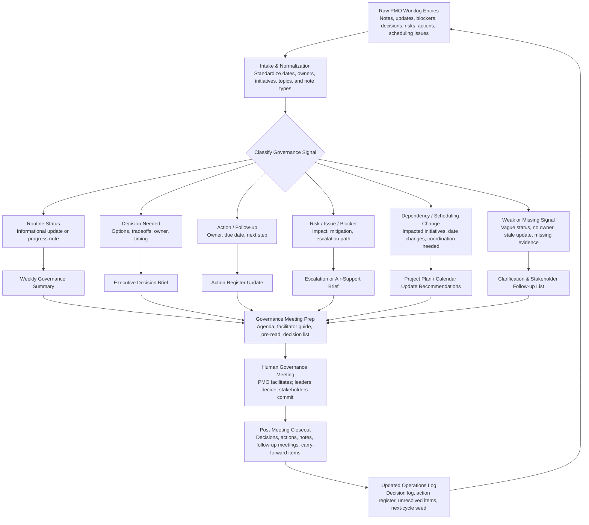

# Portfolio Governance Operations Log

A human-governed, AI-assisted PMO worklog system for turning rough weekly governance notes into executive-ready portfolio governance artifacts.

This repository is a public-safe PMO and portfolio-governance workflow example. It is designed for portfolio managers, PMO leads, program leaders, governance owners, chiefs of staff, delivery operations leads, and business operators who need a practical way to capture messy operating signals and convert them into usable governance outputs.

It is not a PPM platform, meeting-transcription product, autonomous project manager, or executive decision engine. It is a structured operating layer for PMO work: capture, classification, follow-up, meeting preparation, escalation framing, plan-update recommendations, and post-meeting closeout.

## What problem this solves

Portfolio governance often breaks down between formal meetings. The work may be visible, but not governable. Common symptoms include:

- status updates that say “green” without evidence;
- actions with no owner or due date;
- decisions requested without options or tradeoffs;
- risks noted without mitigation or accountable follow-up;
- blockers discussed repeatedly but not escalated cleanly;
- dependency conflicts buried in chat, email, status decks, or meeting notes;
- sponsor questions that never become tracked follow-up;
- project-plan changes implied by conversation but not confirmed;
- governance meetings consumed by status narration instead of decisions, blockers, ownership, and commitments.

The Portfolio Governance Operations Log gives a PMO operator a repeatable way to capture those signals during the week and convert them into reviewable outputs before and after governance meetings.

## Positioning

This project demonstrates practical AI-assisted portfolio governance without handing authority to the AI.

The AI can classify rough notes, detect weak signals, draft summaries, prepare agendas, suggest follow-ups, and recommend updates for human confirmation. It cannot approve work, reprioritize the portfolio, accept risk, reassign owners, change funding, modify calendars, send messages, or update project plans on its own.

## Who this is for

Primary users:

- PMO leads
- Portfolio managers
- Program managers
- Project managers
- Governance leads
- Chiefs of staff
- Operations managers
- Delivery leaders
- Business owners who run recurring governance meetings
- Knowledge workers who coordinate cross-functional work

Secondary users:

- Senior managers and executives who consume governance outputs
- Stakeholders who owe updates, actions, decisions, or risk input
- AI builders looking for a public-safe example of practical PMO workflow design
- Job seekers demonstrating AI-assisted operating-model thinking without presenting the repository as a software engineering portfolio

## Search and discovery terms

This project is relevant to PMO operations, EPMO governance, portfolio management, program management, project governance, RAID management, decision logs, action registers, executive operating cadence, governance meeting preparation, stakeholder follow-up, project escalation, executive air support, portfolio signal quality, AI-assisted PMO workflows, human-in-the-loop AI, and practical AI operating systems for business work.

## What it does

The system helps a PMO operator:

1. capture rough worklog entries during the week;
2. normalize and classify governance signals;
3. detect missing owners, due dates, decision options, mitigation plans, evidence, and escalation asks;
4. separate routine status from decisions, blockers, risks, dependencies, escalations, and follow-through;
5. generate weekly governance summaries;
6. prepare governance meeting agendas and facilitator guides;
7. draft stakeholder follow-up requests;
8. draft executive air-support briefs;
9. recommend project-plan, RAID, decision-log, and action-register updates;
10. process meeting notes into structured closeout records;
11. carry unresolved items into the next governance cycle.

## What it does not do

The system does not:

- make governance decisions;
- approve, cancel, fund, sequence, or reprioritize work;
- accept risk;
- reassign owners;
- send emails or chat messages;
- modify calendars;
- modify live project plans;
- connect to external systems;
- replace the PMO, sponsor, steering committee, accountable delivery owner, or executive decision process.

## Why this repository is leaner than the first public package

Earlier versions separated prompts, guidance, rubrics, agents, sample prompts, templates, and generated outputs into many folders. That helped documentation coverage but made the repository feel overbuilt and obscured the actual ChatGPT runtime.

This version keeps the full capability set but removes duplicate structures. The operating logic lives in one flat ChatGPT runtime folder. GitHub support files are limited to examples, sample data, selected templates, workflow diagrams, a local CLI, and one self-critique.

## Repository design

This package is split into two clear layers:

1. **ChatGPT Project runtime layer** — `chatgpt-project/`, a single flat folder capped at 25 files.
2. **GitHub support layer** — examples, selected templates, workflow files, a lightweight CLI, and quality review.

Use the runtime layer when you want to operate the system inside ChatGPT. Use the broader repository when you want to inspect examples, run the sample CLI, or understand how the system is structured.

## Use in ChatGPT Project space

Upload only the files inside:

```text
chatgpt-project/
```

Do not upload the full repository into a ChatGPT Project. The other folders are for GitHub documentation, sample artifacts, local/Codex use, and public demonstration.

### Recommended ChatGPT Project setup

1. Create a new ChatGPT Project named `Portfolio Governance Operations Log`.
2. Upload all files from `chatgpt-project/` into that project.
3. Use this project instruction:

```text
Use this as a human-governed PMO operations log. Classify my rough notes, flag missing information, draft governance outputs, and identify follow-up needs. Do not make decisions, approve changes, reassign owners, accept risks, send messages, modify calendars, or state that a decision was made unless I explicitly provide that decision.
```

4. Start by pasting rough notes, worklog fragments, stakeholder updates, meeting notes, or action-item lists.
5. Ask for one of the workflow outputs: classification, weekly summary, meeting prep, stakeholder follow-up, executive air-support brief, project-plan update recommendations, post-meeting closeout, or signal quality review.

## Example ChatGPT commands

```text
Classify these weekly PMO notes. Flag missing owners, due dates, weak signals, blockers, decisions needed, and escalation candidates.
```

```text
Turn this week’s classified worklog into an executive-ready governance summary. Keep it concise and separate routine status from decisions, risks, blockers, and follow-up.
```

```text
Prepare a 60-minute governance meeting agenda and facilitator guide. Focus on decisions, blockers, ownership, and carry-forward items.
```

```text
Create an executive air-support brief for the Customer Portal dependency issue. Do not exaggerate urgency. Show options, tradeoffs, requested action, and risk of no action.
```

```text
Process these rough meeting notes into decisions, actions, owners, due dates, unresolved items, follow-up meetings, and next-cycle carry-forward topics.
```

## Use in Codex or a local repository

Use the full repository when you want to inspect, modify, or extend the local sample tool.

From the repository root:

```bash
python tools/build_governance_outputs.py
```

The tool uses only Python standard libraries. It reads synthetic CSV files from `examples/sample-data/`, validates required columns, classifies worklog entries with transparent rule-based logic, and regenerates a consolidated sample output pack under `examples/sample-outputs/`.

Generated files:

- `examples/sample-outputs/sample_output_pack.md`
- `examples/sample-outputs/sample-output-pack.html`
- `examples/sample-outputs/findings_log.csv`
- `examples/sample-outputs/findings_log.jsonl`

Suggested Codex tasks:

- Run `python tools/build_governance_outputs.py` and verify the sample output pack regenerates.
- Add a transparent classification rule for vendor-readiness risk.
- Add a CSV validation check for duplicate worklog IDs.
- Improve HTML output styling without external dependencies.
- Add a small test fixture for missing owner and missing due date detection.

## Folder structure

```text
portfolio-governance-operations-log/
  README.md
  AGENTS.md
  LICENSE.md
  .gitignore

  chatgpt-project/                  # flat 25-file ChatGPT Project runtime
    00_PROJECT_START_HERE.md
    01_OPERATING_MODEL.md
    02_WORKLOG_INTAKE_AND_CLASSIFICATION.md
    03_WEEKLY_GOVERNANCE_SUMMARY.md
    04_MEETING_PREP_AND_FACILITATION.md
    05_MEETING_NOTES_PROCESSING.md
    06_STAKEHOLDER_FOLLOW_UP.md
    07_EXECUTIVE_AIR_SUPPORT_BRIEF.md
    08_PROJECT_PLAN_UPDATE_RECOMMENDATIONS.md
    09_POST_MEETING_CLOSEOUT.md
    10_SIGNAL_QUALITY_REVIEW.md
    11_OUTPUT_FORMATS.md
    12_HUMAN_CONTROL_RULES.md
    13_ARTIFACT_INGESTION_AND_PRIVACY.md
    14_QUALITY_RUBRICS.md
    15_SAMPLE_SCENARIO.md
    16_TRIGGER_MAP.md
    17_FILE_CALL_MAP.md
    18_COPY_PASTE_TEMPLATES.md
    19_STYLE_AND_TONE_RULES.md
    20_FAILURE_MODES_AND_SELF_CHECK.md
    21_EXAMPLE_USER_COMMANDS.md
    22_MINI_REFERENCE.md
    23_CHANGELOG.md
    24_PROJECT_LIMITS.md

  examples/
    sample-data/                    # synthetic CSV source data
    sample-prompts/                 # example user prompts
    sample-outputs/                 # consolidated generated outputs and findings logs

  templates/                        # selected standalone templates only
  tools/                            # local standard-library Python CLI
  workflow/                         # Mermaid workflow files
  quality-review/                   # senior PMO self-critique
```

## Workflow



## Core workflow modules

| Module | Purpose | Primary outputs |
|---|---|---|
| Worklog Intake and Classification | Convert rough notes into structured governance signals | Classified worklog, missing fields, review flags |
| Weekly Governance Summary | Summarize the week’s material governance signals | Executive summary, concerns, decisions, escalations, overdue actions |
| Meeting Preparation | Prepare a governance meeting that focuses on decisions and follow-through | Agenda, facilitator guide, decision list, challenge questions |
| Meeting Notes Processing | Convert raw meeting notes into governance records | Decisions, actions, owners, due dates, risks, unresolved items |
| Stakeholder Follow-Up | Identify who owes what | Follow-up list, clarification requests, reminder drafts |
| Executive Air-Support Brief | Frame issues needing executive help | Business impact, options, ask, risk of no action |
| Project Plan Update Recommendations | Identify plan changes implied by notes | Suggested task, milestone, date, dependency, RAID updates |
| Post-Meeting Closeout | Preserve meeting outcomes and seed the next cycle | Decision log, action register, carry-forward list |
| Signal Quality Review | Challenge low-quality governance signals | Missing owners, weak evidence, stale updates, vague decisions |

## Synthetic sample scenario

The included sample data uses fictional people and fictional initiatives only. It demonstrates a weekly portfolio governance cycle across four initiatives:

1. **Regulatory Reporting Remediation** — compliance-oriented, with deadline confidence concerns and a possible scope deferral decision.
2. **Customer Portal Modernization** — customer-experience and growth-oriented, blocked by Data Platform readiness and needing executive air support.
3. **Field Operations Workflow Automation** — operational-efficiency-oriented, with change-management risk and overdue stakeholder updates.
4. **Data Platform Stabilization** — platform-foundation / technical-debt-oriented, with multiple downstream dependencies and weak evidence behind green status.

The synthetic worklog includes missing status, stale green status, blocked dependency, executive air-support need, follow-up meeting to schedule, rescheduled governance session, overdue action, risk without mitigation, unclear decision options, project-plan date change, sponsor request, stakeholder follow-up, and carry-forward items.

## Human-control statement

This project keeps governance authority with people.

The system may say:

- This note appears to require stakeholder follow-up.
- This issue may need executive air support.
- This decision request lacks clear options.
- This update appears stale or under-supported.
- This action lacks an owner or due date.
- This project-plan change should be confirmed before updating the plan.

The system must not say:

- The project has been reprioritized.
- The funding is approved.
- This risk is accepted.
- This project should be canceled.
- This owner has been reassigned.
- The executive team decided this unless the user provided that decision explicitly.

## Data privacy

All sample data is synthetic. Do not add real employer, client, financial, security, personal, legal, medical, or proprietary data to public examples.

For real usage, keep sensitive data out of public repositories. Use sanitized initiative names, generalized role labels, and redacted operating details when demonstrating the workflow.

## License

See `LICENSE.md`.
