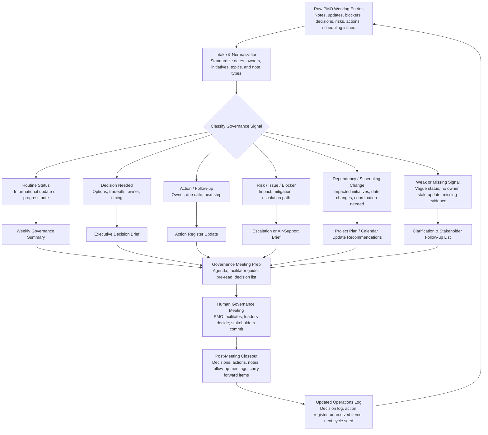

# Portfolio Governance Operations Log Workflow

```mermaid
flowchart TD
    A[Raw PMO Worklog Entries<br/>Notes, updates, blockers, decisions, risks, actions, scheduling issues] --> B[Intake & Normalization<br/>Standardize dates, owners, initiatives, topics, and note types]

    B --> C{Classify Governance Signal}

    C --> D[Routine Status<br/>Informational update or progress note]
    C --> E[Decision Needed<br/>Options, tradeoffs, owner, timing]
    C --> F[Action / Follow-up<br/>Owner, due date, next step]
    C --> G[Risk / Issue / Blocker<br/>Impact, mitigation, escalation path]
    C --> H[Dependency / Scheduling Change<br/>Impacted initiatives, date changes, coordination needed]
    C --> I[Weak or Missing Signal<br/>Vague status, no owner, stale update, missing evidence]

    D --> J[Weekly Governance Summary]
    E --> K[Executive Decision Brief]
    F --> L[Action Register Update]
    G --> M[Escalation or Air-Support Brief]
    H --> N[Project Plan / Calendar Update Recommendations]
    I --> O[Clarification & Stakeholder Follow-up List]

    J --> P[Governance Meeting Prep<br/>Agenda, facilitator guide, pre-read, decision list]
    K --> P
    L --> P
    M --> P
    N --> P
    O --> P

    P --> Q[Human Governance Meeting<br/>PMO facilitates; leaders decide; stakeholders commit]

    Q --> R[Post-Meeting Closeout<br/>Decisions, actions, notes, follow-up meetings, carry-forward items]
    R --> S[Updated Operations Log<br/>Decision log, action register, unresolved items, next-cycle seed]
    S --> A
```
